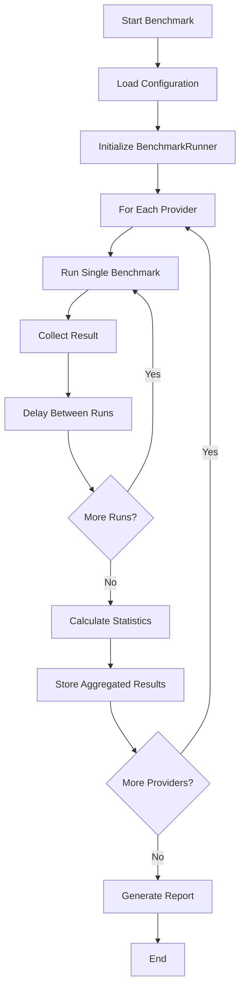

# Benchmark Architecture: Multiple Runs with Averaging

## Overview

This document outlines the architecture for enhancing the current sandbox benchmark system to run benchmarks multiple times (default: 5 runs) and calculate statistical averages for more reliable performance measurements.

## Current State Analysis

### Existing Implementation
- **Single Run Execution**: Each provider (E2B, Daytona) runs once per benchmark session
- **Metrics Tracked**: 
  - `sandboxCreationTime`: Time to create sandbox instance
  - `fileCreationTime`: Time to create a file in the sandbox
  - `totalTime`: End-to-end execution time
- **Output**: Simple comparison table with single data points

### Limitations
- Results can be skewed by network conditions, system load, or provider variability
- No statistical reliability or confidence intervals
- Single failures completely invalidate benchmark runs
- No insight into performance consistency

## Proposed Architecture

### 1. Enhanced Data Structures

```typescript
interface BenchmarkRun {
  runNumber: number;
  sandboxCreationTime: number;
  fileCreationTime: number;
  totalTime: number;
  success: boolean;
  error?: string;
  timestamp: Date;
}

interface BenchmarkResult {
  name: string;
  runs: BenchmarkRun[];
  averages: {
    sandboxCreationTime: number;
    fileCreationTime: number;
    totalTime: number;
  };
  statistics: {
    standardDeviation: {
      sandboxCreationTime: number;
      fileCreationTime: number;
      totalTime: number;
    };
    min: {
      sandboxCreationTime: number;
      fileCreationTime: number;
      totalTime: number;
    };
    max: {
      sandboxCreationTime: number;
      fileCreationTime: number;
      totalTime: number;
    };
  };
  successRate: number;
  totalRuns: number;
  failedRuns: BenchmarkRun[];
}

interface BenchmarkConfig {
  runCount: number;
  delayBetweenRuns: number; // milliseconds
  failFast: boolean;
  verbose: boolean;
  outlierDetection: boolean;
}
```

### 2. Core Components

#### BenchmarkRunner Class
Primary orchestrator for multi-run benchmark execution.

```typescript
class BenchmarkRunner {
  constructor(config: BenchmarkConfig);
  
  async runMultiple(
    benchmarkFn: () => Promise<SingleRunResult>, 
    providerName: string
  ): Promise<BenchmarkResult>;
  
  private calculateStatistics(runs: BenchmarkRun[]): Statistics;
  private detectOutliers(values: number[]): number[];
  private delay(ms: number): Promise<void>;
}
```

**Responsibilities:**
- Execute benchmark function multiple times
- Collect and aggregate results
- Calculate statistical measures
- Handle failures and retries
- Manage delays between runs

#### Provider Wrappers
Abstraction layer around existing benchmark functions.

```typescript
interface SingleRunResult {
  sandboxCreationTime: number;
  fileCreationTime: number;
  totalTime: number;
  success: boolean;
  error?: string;
}

async function runSingleE2BBenchmark(): Promise<SingleRunResult>;
async function runSingleDaytonaBenchmark(): Promise<SingleRunResult>;
```

**Responsibilities:**
- Wrap existing benchmark logic
- Return standardized single-run results
- Maintain timing accuracy
- Handle provider-specific cleanup

#### Statistics Calculator
Utility for computing statistical measures.

```typescript
class StatisticsCalculator {
  static calculateMean(values: number[]): number;
  static calculateStandardDeviation(values: number[]): number;
  static calculateMedian(values: number[]): number;
  static findOutliers(values: number[], threshold: number): number[];
  static calculateConfidenceInterval(values: number[], confidence: number): [number, number];
}
```

### 3. Execution Flow



#### Detailed Execution Steps

1. **Initialization**
   - Load configuration from environment variables or defaults
   - Initialize BenchmarkRunner with config
   - Prepare result storage

2. **Provider Execution Loop**
   ```typescript
   for (const provider of providers) {
     const results = await benchmarkRunner.runMultiple(
       provider.benchmarkFunction,
       provider.name
     );
     aggregatedResults.push(results);
   }
   ```

3. **Single Run Execution**
   - Execute provider benchmark function
   - Measure timing with high precision
   - Handle errors gracefully
   - Apply optional delay between runs
   - Detect and flag outliers

4. **Statistical Analysis**
   - Calculate mean, median, standard deviation
   - Identify outliers (optional)
   - Compute confidence intervals
   - Calculate success rates

5. **Result Aggregation**
   - Combine individual runs into provider results
   - Generate comparative statistics
   - Prepare visualization data

### 4. Configuration System

#### Environment Variables
```bash
BENCHMARK_RUN_COUNT=5          # Number of runs per provider
BENCHMARK_DELAY_MS=1000        # Delay between runs (ms)
BENCHMARK_FAIL_FAST=false      # Stop on first failure
BENCHMARK_VERBOSE=false        # Show individual run details
BENCHMARK_OUTLIER_DETECTION=true # Enable outlier detection
BENCHMARK_CONFIDENCE_LEVEL=0.95  # Confidence interval level
```

#### Configuration Loading
```typescript
const config: BenchmarkConfig = {
  runCount: parseInt(process.env.BENCHMARK_RUN_COUNT || '5'),
  delayBetweenRuns: parseInt(process.env.BENCHMARK_DELAY_MS || '1000'),
  failFast: process.env.BENCHMARK_FAIL_FAST === 'true',
  verbose: process.env.BENCHMARK_VERBOSE === 'true',
  outlierDetection: process.env.BENCHMARK_OUTLIER_DETECTION !== 'false'
};
```

### 5. Output and Reporting

#### Enhanced Results Display

```
=== Sandbox Benchmark Results (5 runs each) ===
Provider  | Avg Sandbox   | Avg File      | Avg Total     | Success | Std Dev Total
----------|---------------|---------------|---------------|---------|---------------
E2B       | 2247.57ms     | 299.48ms      | 2547.06ms     | 100%    | ±143.2ms
          | (2104-2391)   | (256-342)     | (2404-2690)   | (5/5)   |
Daytona   | 1727.43ms     | 686.49ms      | 2415.49ms     | 80%     | ±298.7ms
          | (1489-1966)   | (598-774)     | (2087-2744)   | (4/5)   |

=== Statistical Summary ===
🏆 Most Consistent: E2B (lower std deviation)
🚀 Fastest Average: Daytona (2415.49ms vs 2547.06ms)
📊 Confidence Level: 95%

=== Individual Run Details (Verbose Mode) ===
E2B Runs:
  Run 1: Sandbox: 2247ms, File: 299ms, Total: 2546ms ✅
  Run 2: Sandbox: 2104ms, File: 256ms, Total: 2360ms ✅
  ... (additional runs)
```

#### Progress Indicators
```
Running E2B benchmarks...
[████████████████████] 5/5 runs completed (100%)

Running Daytona benchmarks...
[████████████████░░░░] 4/5 runs completed (80%) - 1 failed
```

### 6. Error Handling Strategy

#### Failure Modes
1. **Provider Connection Failures**: Network timeouts, service unavailable
2. **Sandbox Creation Failures**: Resource exhaustion, API limits
3. **File Operation Failures**: Permission errors, storage issues
4. **Timeout Failures**: Operations exceeding reasonable time limits

#### Handling Strategy
```typescript
interface FailureHandling {
  maxRetries: number;
  retryDelay: number;
  failFast: boolean;
  partialResultsAcceptable: boolean;
}
```

- **Graceful Degradation**: Continue with remaining providers if one fails
- **Partial Results**: Accept results from successful runs only
- **Retry Logic**: Configurable retry attempts for transient failures
- **Detailed Logging**: Capture failure reasons for analysis

### 7. Performance Considerations

#### Memory Management
- Stream large result sets instead of storing all in memory
- Clean up sandbox resources immediately after each run
- Implement garbage collection hints for long-running benchmarks

#### Execution Optimization
- **Sequential vs Parallel**: Run providers sequentially to avoid resource contention
- **Resource Isolation**: Ensure clean state between runs
- **Timing Precision**: Use `performance.now()` for microsecond accuracy

#### Scalability
- Support for additional providers through plugin architecture
- Configurable concurrency levels for multiple provider testing
- Result caching for development/testing scenarios

## Implementation Phases

### Phase 1: Core Infrastructure (Week 1)
- [ ] Update data structures and interfaces
- [ ] Implement BenchmarkRunner class
- [ ] Create StatisticsCalculator utility
- [ ] Add configuration system

### Phase 2: Provider Integration (Week 1)
- [ ] Refactor existing benchmark functions
- [ ] Implement provider wrappers
- [ ] Add error handling and cleanup logic
- [ ] Test individual provider execution

### Phase 3: Statistical Analysis (Week 2)
- [ ] Implement statistical calculations
- [ ] Add outlier detection
- [ ] Create confidence interval calculations
- [ ] Validate statistical accuracy

### Phase 4: Enhanced Reporting (Week 2)
- [ ] Update output formatting
- [ ] Add verbose mode with individual run details
- [ ] Implement progress indicators
- [ ] Create summary statistics display

### Phase 5: Testing & Validation (Week 3)
- [ ] Unit tests for all components
- [ ] Integration tests with actual providers
- [ ] Performance testing of benchmark runner
- [ ] Documentation and examples

## Benefits

### Reliability
- **Statistical Validity**: Multiple runs provide confidence in results
- **Outlier Handling**: Identify and handle anomalous measurements
- **Failure Resilience**: Partial failures don't invalidate entire benchmark

### Insights
- **Performance Consistency**: Standard deviation shows reliability
- **Trend Analysis**: Historical comparison of benchmark runs
- **Confidence Intervals**: Statistical bounds on measurements

### Usability
- **Configurable**: Adjust run count and behavior via environment variables
- **Verbose Output**: Detailed breakdown when needed
- **Progress Tracking**: Real-time feedback during execution

### Extensibility
- **Provider Agnostic**: Easy to add new sandbox providers
- **Metric Flexible**: Simple to add new timing measurements
- **Output Formats**: Support multiple result formats (JSON, CSV, etc.)

## Future Enhancements

1. **Historical Tracking**: Store results in database for trend analysis
2. **Continuous Integration**: Automated benchmark runs in CI/CD
3. **Alerting**: Performance regression detection
4. **Visualization**: Charts and graphs for result analysis
5. **Distributed Testing**: Multi-region benchmark execution
6. **Load Testing**: Concurrent user simulation scenarios